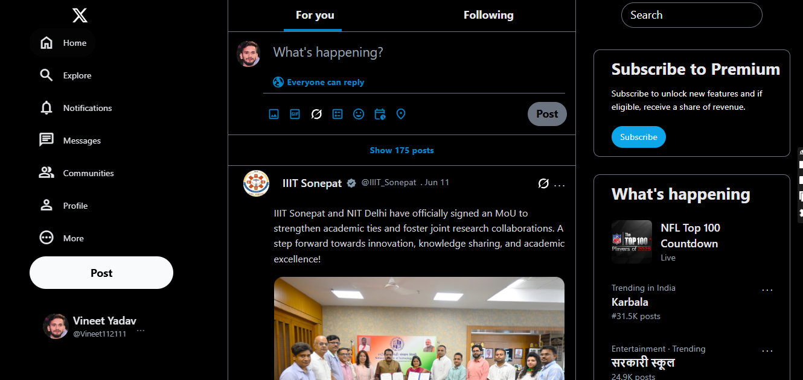

# 🐦 Twitter Home Page Clone

A responsive **Twitter Home Page UI clone** built using **HTML** and **Tailwind CSS**. This project replicates the real Twitter layout and is great for practicing frontend development.

## 🔗 Live Demo

[Click here to view live](https://Vineet112111.github.io/twitter-clone/)  

## 🖼️ Preview

  

## 🛠️ Tech Stack

- HTML5  
- Tailwind CSS  
- Tailwind CLI  
- Node.js (for running Tailwind build)

## 📁 Folder Structure

- `src/input.css` – Tailwind source file  
- `index.html` – Final HTML output  
- `tailwind.config.js` – Tailwind config  
- `package.json` – Project setup info  

## 🚀 How to Run Locally

```bash
git clone https://github.com/Vineet112111/twitter-clone.git
cd twitter-clone
npm install
npx tailwindcss -i ./src/input.css -o .src/output.css --watch
```

Then open `./index.html` in your browser.

## 🙋‍♂️ Author

**Vineet Kumar Yadav**  
IIIT Sonepat  
GitHub: [Vineet112111](https://github.com/Vineet112111)

## 📜 License

This project is open-source and available under the [MIT License](LICENSE).

---

⭐ Don't forget to star the repo if you liked it!
